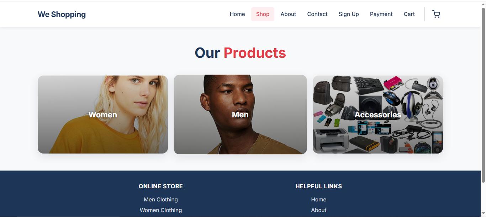
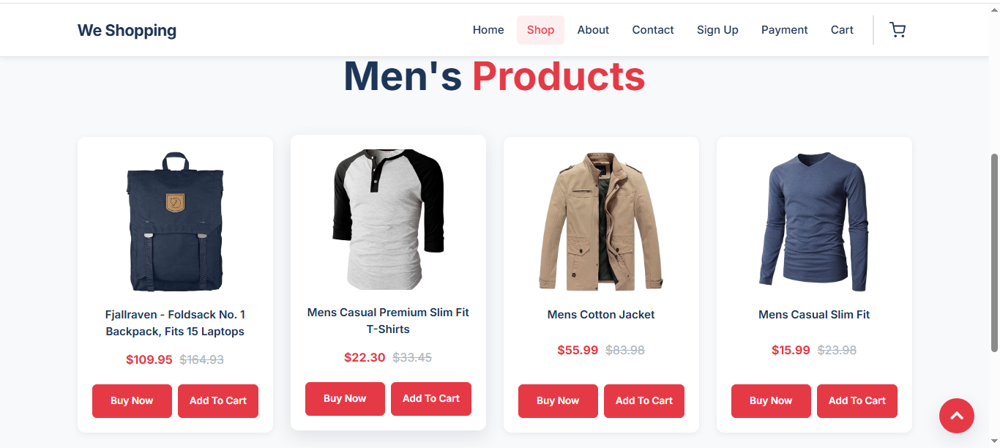
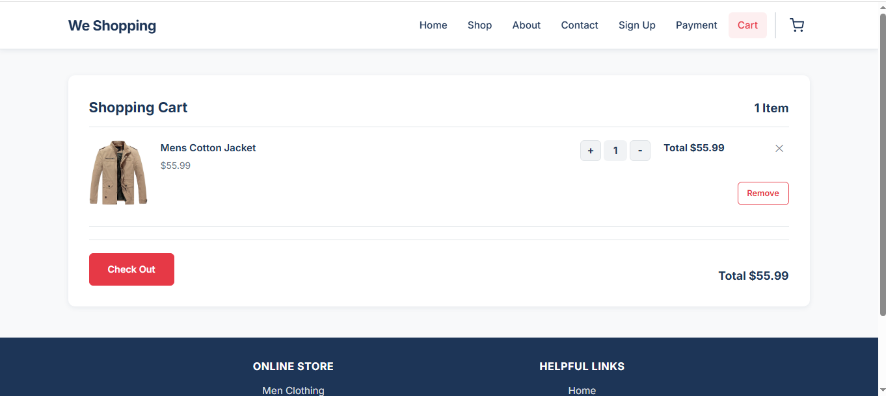
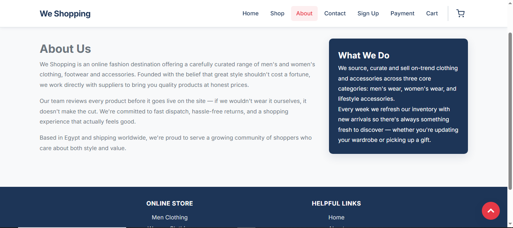
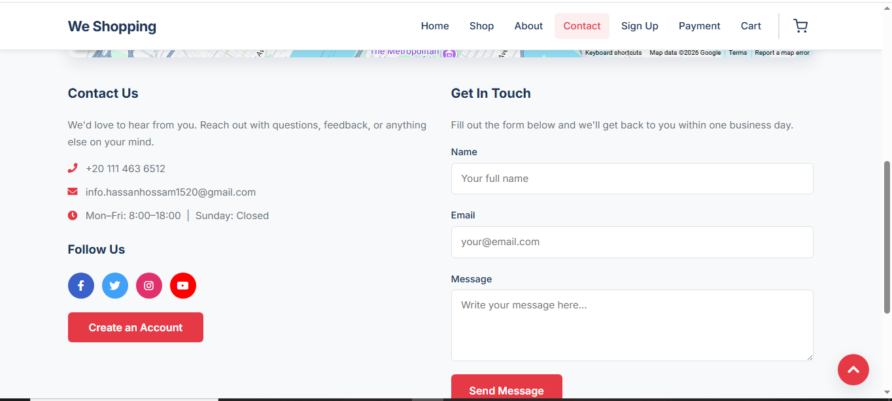
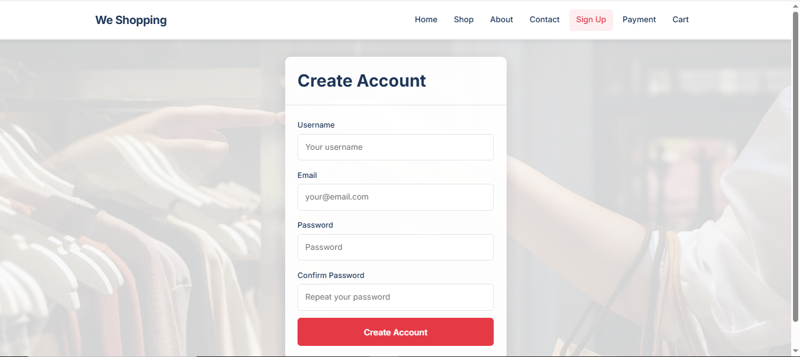
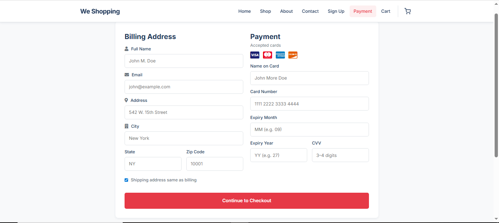

# 🛍️ We Shopping — Responsive E‑Commerce Store

<p align="center">
  
  
  
  
  
</p>

A modern **responsive e-commerce storefront** built using **HTML, CSS, JavaScript, PHP, and MySQL**.

The project demonstrates a complete shopping experience including product browsing, shopping cart, checkout, and user registration. Product data is loaded from both static content and the FakeStore API.

> **Note:** The frontend works independently, while the Sign Up and Payment pages require a PHP & MySQL backend.

---

# ✨ Features

- 📱 Fully Responsive Design
- 🛒 Shopping Cart (LocalStorage)
- 👕 Dynamic Men's Products (FakeStore API)
- 👗 Static Women's & Accessories Products
- 🔍 Product Details Modal
- 🔔 Toast Notifications
- ✅ Client-side Form Validation
- 💳 Checkout & Payment Form
- ♿ Accessible Navigation
- ⬆️ Scroll-to-Top Button
- 📅 Automatic Footer Copyright Year

---

# 🚀 Tech Stack

- HTML5
- CSS3
- JavaScript (ES6)
- PHP
- MySQL
- FakeStore API
- Font Awesome
- LocalStorage

---

# 📸 Screenshots

| Home | Shop |
|------|------|
|  |  |

| Men Products | Cart |
|------|------|
|  |  |

| About | Contact |
|------|------|
|  |  |

| Sign Up | Payment |
|------|------|
|  |  |

---

# 📂 Project Structure

```text
we-shopping/
│
├── index.html
├── css/
│   ├── Css.css
│   └── signup.css
│
├── js/
│   ├── main.js
│   ├── signup-form.js
│   └── all.min.js
│
├── pages/
│   ├── shop.html
│   ├── men.html
│   ├── woman.html
│   ├── accessories.html
│   ├── cart.html
│   ├── about.html
│   ├── CONTACT.html
│   ├── services.html
│   ├── signup.php
│   └── payment.php
│
├── images/
└── screenshots/
```

---

# ⚙️ Requirements

- Chrome / Firefox / Edge / Safari
- PHP 8+
- MySQL / MariaDB
- XAMPP, Laragon, WAMP or PHP Built-in Server

---

# 💻 Installation

## Clone the repository

```bash
git clone https://github.com/Hassan1520/we-shopping-store.git
cd we-shopping
```

## Run the project

### Frontend only

Open **index.html** or use **VS Code Live Server**.

### PHP Version

```bash
php -S localhost:8000
```

Then visit:

```
http://localhost:8000
```

---

# 🗄️ Database

Create a database called:

```sql
data
```

Create the following tables.

### signup

```sql
CREATE TABLE signup (
    id INT AUTO_INCREMENT PRIMARY KEY,
    username VARCHAR(100) NOT NULL,
    email VARCHAR(150) NOT NULL,
    password VARCHAR(255) NOT NULL,
    confirmpassword VARCHAR(255) NOT NULL,
    created_at TIMESTAMP DEFAULT CURRENT_TIMESTAMP
);
```

### payment

```sql
CREATE TABLE payment (
    id INT AUTO_INCREMENT PRIMARY KEY,
    firstname VARCHAR(100),
    email VARCHAR(150),
    address VARCHAR(255),
    city VARCHAR(100),
    state VARCHAR(50),
    zip VARCHAR(20),
    cardname VARCHAR(100),
    cardnumber VARCHAR(20),
    expmonth VARCHAR(10),
    expyear VARCHAR(4),
    cvv VARCHAR(4),
    created_at TIMESTAMP DEFAULT CURRENT_TIMESTAMP
);
```

Update the database credentials inside:

- `pages/signup.php`
- `pages/payment.php`

---

# 🔌 Backend Integration

| Page | Method | Action |
|------|--------|--------|
| signup.php | POST | User Registration |
| payment.php | POST | Checkout Payment |

---

# 📈 Future Improvements

- User Authentication
- Login System
- Wishlist
- Product Search
- Filters
- Product Reviews
- Order History
- Admin Dashboard
- Order Tracking
- Dark Mode
- Email Verification
- Password Reset

---

# 🔒 Security Notes

Before deploying to production:

- Use `password_hash()`
- Use `password_verify()`
- Replace raw SQL with Prepared Statements
- Add CSRF Protection
- Validate all server-side input
- Escape output to prevent XSS

---

# 📝 Development Notes

- Cart data is stored in LocalStorage.
- Men's products are loaded from FakeStore API.
- Static pages are built with HTML/CSS.
- JavaScript modules initialize only when required.
- Font Awesome is loaded from CDN by default.

---

# 👨‍💻 Author

**Hassan**

---

# 📄 License

This project is licensed under the **MIT License**.